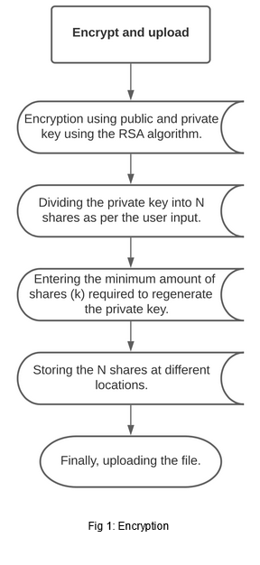
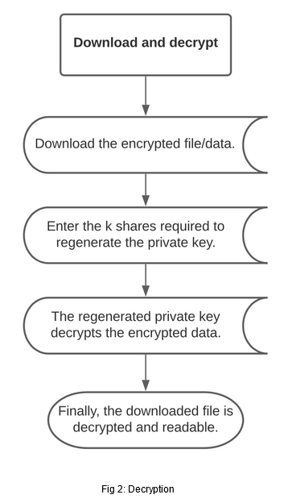
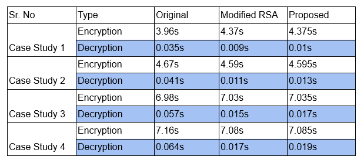
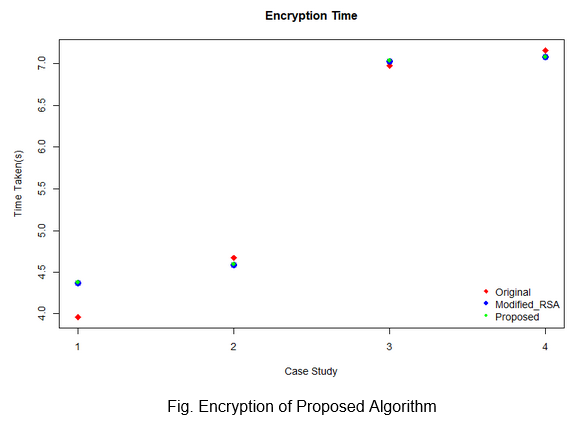
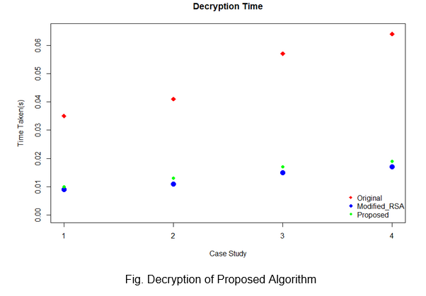

# LockNKey
## Improving Cloud Security Systems using Threshold Cryptography
### The processes such as Shamir’s Secret Sharing and Lagrange Interpolation Method have been used to further increase and improve the security of the data being stored.
### In this approach, there is no need for a user certification mechanism between user and Distributed Data Centers. Other approaches assume that there is a certification mechanism which in case if isn't present then there exists a threat that encryption key may be leaked by the malicious user who acquired the hardware wallet(storing the keys) lost by the user, since it is possible to collect at least t number of optional key fragments.
### The approach we have used allows the Implementation to be a GUI based application that can be used to improve the security of files stored on the cloud by using a process of encryption. The current verison uses Google Drive for cloud support.

## Flow chart 
<h2> Encrypt </h2>

    

<h2> Decrypt </h2>

  

<h2>Comparison Study of Propopsed Algorithm </h2>

  

  

  

## Contributors

